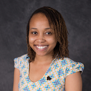
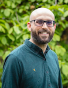
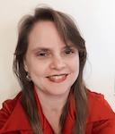
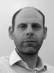
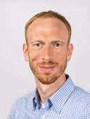

## Building Research Software Communities

### **Workshop:** Wednesday 17th / Thursday 18th March 2021, 09:00-11:00 UTC

#### Workshop organisers

<small>Jeremy Cohen, Imperial College London, UK</small> 
<small>Michelle Barker, Research Software Alliance (ReSA), Australia</small> 
<small>Daniel Nüst, University of Münster, Germany</small> 

- [Workshop introduction](#workshop-introduction)
- [Speakers](#speakers)
- [Agenda](#agenda)
- [Session details](#session-details)
- [Registration](#registration)
- [Code of Conduct](#code-of-conduct)
- [About the organisers](#about-the-organisers)

## Workshop introduction

Research Software Engineering (RSE) has come a long way since the term was first coined less than 10 years ago. This development has been underpinned by a strong and continually growing community of researchers, software engineers and now, RSEs, who recognise the importance of software to the research community and its vital contribution to high-quality research outputs.

Researchers and academics have been building software as part of their research for many decades. However, the increasing importance of and need for software in undertaking research in many more domains led to more and more researchers spending their time focusing on software development. Combined with less time to spend on traditional research tasks, including writing papers, this led to the emergence of a group of experienced researchers with advanced software development skills who lacked the traditional CVs to progress along a standard academic career path. Ultimately, a group of individuals coming together and forming a community to advocate for the importance of software in research led to the RSE community that we have today. This demonstrates the huge importance of communities and what they can achieve. You can read the full story of the emergence of Research Software Engineering in Simon Hettrick's blog post "[_A not-so-brief history of Research Software Engineers_](https://www.software.ac.uk/blog/2016-08-17-not-so-brief-history-research-software-engineers-0)".

So, communities are very important! Unfortunately they're not always straightforward to set up and they can be even more challenging to sustain. Within the RSE community we now have a number of national communities, local communities at individual institutions and the first regional communities emerging.

This interactive workshop will provide an opportunity to share experiences, challenges and successes and to learn from experts in the wider field of community development, engagement and collaboration.

This workshop is being run as part of the [SORSE series on online research software events](https://sorse.github.io). Visit the [SORSE page for this workshop](https://sorse.github.io/programme/workshops/event-031/) for a link to register to attend the workshop.

## Speakers

We are delighted to welcome a range of speakers including leading experts in scientific community building and collaboration.

### Lou Woodley <small>_Director, Center for Scientific Collaboration and Community Engagement ([CSCCE](https://www.cscce.org/))_</small>

Lou Woodley is founder and director of the Center for Scientific Collaboration and Community Engagement [CSCCE](https://www.cscce.org/). A scientist by training, Lou has spent over a decade building, studying, writing and teaching about communities in STEM. She champions the role of scientific community managers – the human infrastructure necessary for healthy, productive group work. Lou has previously led community-focused projects at Nature Publishing Group, Open Knowledge Foundation, and AAAS.

### Serah Rono <small>_Director of Community Development and Engagement, [The Carpentries](https://carpentries.org/)_</small>

Serah Njambi Rono is a computer scientist and a writer. She is currently the Director of Community Development and Engagement at The Carpentries and has served as a technologist and Developer Advocate in the Open Data, Open Source, Open Science space for more than 8 years now while embedded at organisations like Open Knowledge Foundation and Code for Africa. She has broad and valuable experience in listening to and steering communities, developing and implementing strategies for various technical projects, and around community building, outreach and the sustainability of existing, mature communities. Serah invests her time and energy to work that serves as a precursor to propelling change across communities in different domains, and believes that the work does not stop until all communities are at par in terms of access to resources and empowerment by information that open source initiatives make available. This is the measure by which she defines impact. Often, the outcome of her work has been a spark in community conversations, contributions and adoptions on different subjects, increased opportunity for community leadership and participation, and pockets of knowledge transfer.

### Toby Hodges <small>_Curriculum Community Developer, [The Carpentries](https://carpentries.org/)_</small>

Toby Hodges (he/him) is the Curriculum Community Developer at The Carpentries. A former bioinformatician, Toby has spent the last six years helping community members to share their skills and knowledge. Before joining The Carpentries team in 2020 he managed the EMBL Bio-IT Project, working to build and support a community of bioinformaticians and computational biologists at the European Molecular Biology Laboratory. In his current role, Toby empowers community members to create new lessons in The Carpentries Incubator and develops programs to build connections between individuals with a shared interest in curriculum design and development.

## Agenda

This 4-hour workshop will run over two days, from **09:00 - 11:00 UTC** on both **Wednesday 17th and Thursday 18th March 2021**.

<table>
    <tr>
        <th colspan="2">Day 1: Wednesday 17th March 2021: 09:00 - 11:00 UTC</th>
    </tr>
    <tr>
        <td>09:00</td>
        <td>Workshop introduction, <em>Michelle Barker, ReSA</em></td>
    </tr>
    <tr>
        <td>09:10</td>
        <td>
            5-minute lightning talks <small>These talks will set the scene for the workshop, reporting on experiences, challenges and successes in different aspects of community building.</small>
            <ul>
                <li>Running a first local chapter meeting (de-RSE chapters) <em><small>Daniel Nüst, Univeristy of Münster</small></em></li>
                <li>Nordic-RSE: Developing an international RSE community <em><small>Anne Fouilloux, University of Oslo</small></em></li>
                <li>Building and managing a professional community I: Professional Research Investment and Strategy Managers (PRISMs) <em><small>Anja Roeding, University of Exeter</small></em></li>
                <li>Building and managing a professional community II: UK RSE - challenges and successes <em><small>Simon Hettrick, University of Southampton</small></em></li>
            </ul>
        </td>
    </tr>
    <tr>
        <td>09:35</td>
        <td>
            Your three biggest challenges as a community leader/member 
            <em><small>Small group feedback session led by Daniel Nüst</small></em> 
            <a href="http://bit.ly/community-ws-groups" target="_blank" rel="noreferrer noopener">http://bit.ly/community-ws-groups</a>
        </td>
    </tr>
    <tr>
        <td>09:50</td>
        <td>Break</td>
    </tr>
    <tr>
        <td>10:00</td>
        <td><a href="#engagement-fundamentals">Scientific Community Engagement Fundamentals</a> <em>Lou Woodley, <a href="https://www.cscce.org" target="_blank" rel="noreferrer noopener">Center for Scientific Collaboration and Community Engagement (CSCCE)</a></em></td>
    </tr>
    <tr>
        <td>10:55</td>
        <td>Day 1 wrap-up <small><em>Jeremy Cohen, Imperial College London</em></small></td>
    </tr>
</table>
 

<table>
    <tr>
        <th colspan="2">Day 2: Thursday 18th March 2021: 09:00 - 11:00 UTC</th>
    </tr>
    <tr>
        <td>09:00</td>
        <td>Day 2 introduction, day 1 recap, <em>Jeremy Cohen</em></td>
    </tr>
    <tr>
        <td>09:10</td>
        <td>
            <a href="#champions">Community Champions - discussion session</a> 
            <em><small>led by Lou Woodley, <a href="https://www.cscce.org" target="_blank" rel="noreferrer noopener">CSCCE</a></small></em>
        </td>
    </tr>
    <tr>
        <td>09:50</td>
        <td>Break</td>
    </tr>
    <tr>
        <td>10:00</td>
        <td>
            <a href="#sustainability">Community sustainability</a> (Title TBC) 
            <em>Toby Hodges &amp; Serah Rono, <a href="https://carpentries.org" target="_blank" rel="noreferrer noopener">The Carpentries</a></em></td>
    </tr>
    <tr>
        <td>10:55</td>
        <td>Workshop wrap-up - next steps, ongoing collaboration, links, etc. <small><em>Michelle Barker</em></small></td>
    </tr>
</table>

## Session details

#### Scientific Community Engagement Fundamentals, _Lou Woodley_

Member participation in a community can occur in a range of modes, as described in the [CSCCE Community Participation Model](https://zenodo.org/record/3997802#.YDOdfWNOlpQ), created by staff at the Center for Scientific Collaboration and Community Engagement (CSCCE). In this interactive session, we’ll explore the four core modes and discuss how to meet members where they are to support your community in achieving its goals.

#### Community Champions, _Lou Woodley_

 In [CSCCE’s Community Participation Model](https://zenodo.org/record/3997802#.YDOdfWNOlpQ), which describes the different modes of member engagement within a community, we call the members who take on leadership roles community champions. In this session we’ll explore the different roles that community champions can take on, why they’re important for the culture, growth and sustainability of a community, and how you can support them.

#### Community sustainability, _Toby Hodges and Serah Rono_

One of the major challenges faced by many growing communities is to develop in a way that remains sustainable over time. In this session we will explore the concept of sustainability as it relates to scientific communities, discuss the advantages of promoting sustainability, and share resources and approaches you can use to make sure your community remains healthy, engaged, and effective as it continues to grow.

## Registration

Registration for this workshop is being handled by SORSE. You can register via the [SORSE workshop page](https://sorse.github.io/programme/workshops/event-031/).

## Code of Conduct

This workshop will be run under the [SORSE Code of Conduct](https://sorse.github.io/code-of-conduct/). Please familiarise yourself with the SORSE Code of Conduct prior to attending the workshop.

## About the organisers

This workshop is being organised by Michelle Barker, Jeremy Cohen and Daniel Nüst. A proposal for this workshop was submitted to [SORSE](https://sorse.github.io/) and, following review and acceptance, the workshop is being run as an event in the SORSE Series of Online Research Software Events.

### Michelle Barker <small>_[Research Software Alliance (ReSA)](https://www.researchsoft.org/), Australia_</small>

<small>Dr Michelle Barker is Director of the [Research Software Alliance](https://www.researchsoft.org/) (ReSA), and has extensive expertise in open science, research software, digital workforce capability and digital research infrastructure. As a sociologist, Michelle is passionate about building collaborative partnerships to achieve system change. She is Co-chair of the [Research Data Alliance](https://www.rd-alliance.org/) [Organisational Advisory Board](https://rd-alliance.org/about-rda/our-leadership/rda-organisational-advisory-board.html), recently chaired the OECD Expert Group on [digital skills for the research sector](https://www.oecd-ilibrary.org/science-and-technology/building-digital-workforce-capacity-and-skills-for-data-intensive-science_e08aa3bb-en), was a member of the OECD Expert Group on [Socioeconomic Impact of Research Infrastructures](https://www.oecd-ilibrary.org/science-and-technology/reference-framework-for-assessing-the-scientific-and-socio-economic-impact-of-research-infrastructures_3ffee43b-en), and is a former Advisory Committee Member of the [US Software Sustainability Institute (URSSI)](http://urssi.us/). Michelle is a former Director of the [Australian Research Data Commons](https://ardc.edu.au/), where she led the strategic planning for the Australian government’s $180 million, five-year investment in ARDC, the [national research software infrastructure investment program](https://nectar.org.au/labs/), and developed a national strategy to enhance digital workforce capacity in the research sector.</small>

### Jeremy Cohen <small>_[Imperial College London](https://www.imperial.ac.uk), UK_</small>

 <small>Jeremy Cohen is an [EPSRC Research Software Engineering Fellow](https://society-rse.org/community/rse-fellows/) based in the Department of Computing at [Imperial College London](https://www.imperial.ac.uk). Jeremy has a background in Computer Science and a PhD in Computing from Imperial. His past research has focused on areas including distributed and service-oriented systems and cloud computing. In recent years he has been involved with the emerging field of Research Software Engineering (RSE) where he has continued to undertake research software development work as part of multi-disciplinary collaborations, in addition to carrying out a range of RSE community development activities and advocacy for RSE. Jeremy leads Imperial’s local [Research Software Community](https://www.imperial.ac.uk/computational-methods/rse/) and also runs [RSLondon](https://rslondon.ac.uk), the regional research software community for London and the South East of England.</small>

### Daniel Nüst <small>_[University of Münster](https://www.uni-muenster.de/en/), Germany_</small>

<small>[Daniel Nüst](https://nordholmen.net/) is a researcher at the [Spatio-temporal Modelling Lab](http://ifgi.uni-muenster.de/labs/spatio-temporal-modelling-lab/) at the [Institute for Geoinformatics](http://ifgi.uni-muenster.de/) (ifgi) at the University of Münster. Daniel pursues a PhD in the context of the DFG project [Opening Reproducible Research](https://o2r.info/) (o2r) where he develops tools for creation and execution of research compendia in geography and geosciences.
He is cofounder of [CODECHECK](https://codecheck.org.uk/), an initiative for independent execution of computational workflows during peer-review, Reproducibility Chair at the AGILE conference series ([Reproducible AGILE](https://reproducible-agile.github.io/)), and vice chair of the [German Society for Research Software - de-RSE e.V.](https://de-rse.org/).
Before he was consultant and software developer at [52°North Initiative for Geospatial Software Solutions GmbH](https://52north.org/).
His professional interest is improving the scholarly publication process with new information technology — of course with Open Source software! He enjoys playing [Ultimate Frisbee](https://www.youtube.com/watch?v=tfyJ3ZspQmk) — the best sport ever invented by man.
</small>